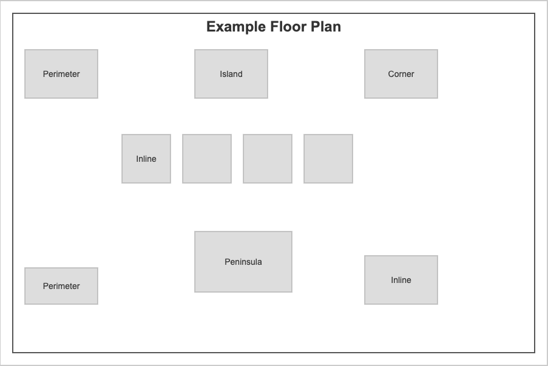
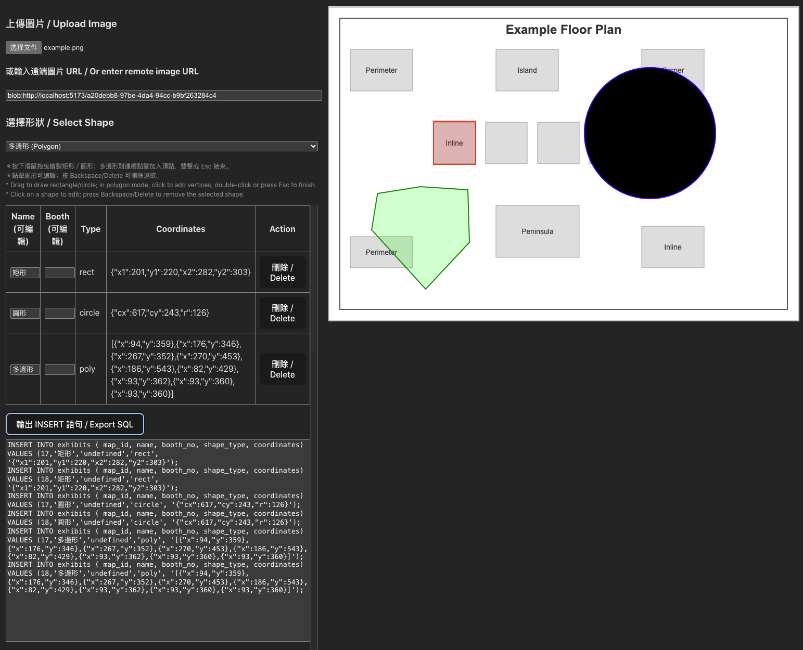

# 中文項目名稱：圖片標註與 SQL 導出工具  
# 英文項目名稱：Image Annotation & SQL Export Tool

## 快速開始 / Quick Start
- **中文：**  
  - 下載項目壓縮包，解開後執行 pnpm install, pnpm run dev，就完成了.
- **English:**  
  - Download the Zip, unzip it and run pnpm install, pnpm run dev, it's all.
  
## 畫面 / ScreenShot

## 功能介紹 / Features

### 1. 圖片上傳與載入 / Image Uploading and Loading
- **中文：**  
  - 支持從本地上傳圖片，也能使用遠端圖片 URL 進行載入，讓使用者快速開始標註工作。
- **English:**  
  - Supports uploading images from local files as well as loading images from remote URLs, enabling users to quickly start annotating.

### 2. 圖形繪製工具 / Shape Drawing Tools
- **中文：**  
  - 提供矩形、圓形和多邊形等圖形繪製模式，使用者可以依需求在圖片上標註出重點區域。
  - 矩形與圓形透過拖曳來繪製；多邊形則透過連續點擊新增頂點，雙擊或按 Esc 鍵完成繪製。
- **English:**  
  - Offers drawing modes for rectangles, circles, and polygons so that users can annotate key regions on images.
  - Rectangles and circles are drawn via dragging, while polygons are created by sequential clicks to add vertices, with double-click or Esc key to finish.

### 3. 互動式圖形編輯 / Interactive Shape Editing
- **中文：**  
  - 支持點擊選取圖形後進行拖曳、縮放、旋轉等編輯操作。
  - 多邊形可直接調整各頂點位置，提供更靈活的標註方式。
  - 提供刪除功能，方便快速移除不需要的標註。
- **English:**  
  - Allows selection of shapes for interactive editing, including dragging, scaling, and rotating.
  - Polygons can have their individual vertices adjusted directly for more flexible annotation.
  - Includes deletion features to easily remove unwanted annotations.

### 4. 資料導出功能 / Data Export Functionality
- **中文：**  
  - 自動將所有繪製的圖形轉換成 SQL INSERT 語句，方便將標註結果整合進資料庫中。
  - 支持自訂欄位（例如名稱、攤位號等），以符合不同應用場景。
- **English:**  
  - Automatically converts all drawn shapes into SQL INSERT statements, making it easy to integrate annotation data into a database.
  - Supports customizable fields (e.g., name, booth number) to suit various application scenarios.

### 5. 基於 React-Konva 的高效渲染 / Efficient Rendering with React-Konva
- **中文：**  
  - 利用 React-Konva 實現高效的 canvas 渲染，確保在標註過程中的流暢體驗。
- **English:**  
  - Utilizes React-Konva for efficient canvas rendering, ensuring a smooth and responsive annotation experience.
